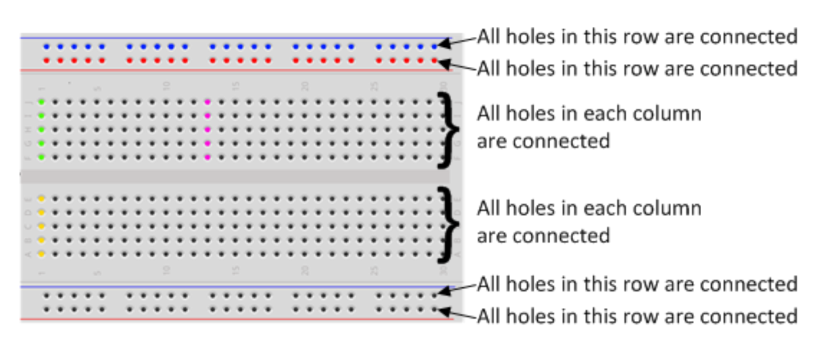
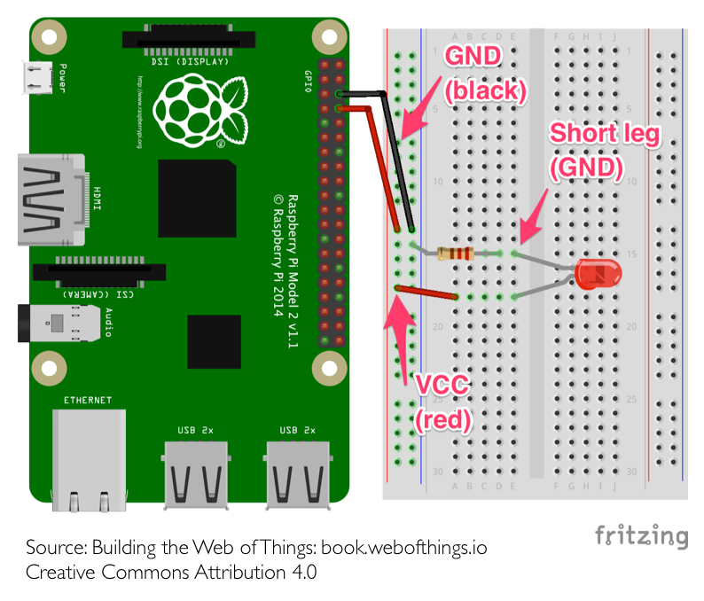

TP1
===
_infos pratiques_ : tous les raspberry ont pour login `pi` et pour mot de passe `raspberry`

1ère partie : Créez un serveur Python Flask sur le raspberry
----------------------------------------------------
. Connectez vous au raspberry à l'aide de la commande ssh :  

```
$ ssh pi@nom-du-raspberry.local
```  
Le nom du raspberry est sur la boîte en carton dans laquel il se trouvait. (certains ordinateurs ne fonctionnent pas avec les noms de domaines locaux, vous devrez alors utiliser l'adresse IP de votre raspberry)

. Créez un dossier pour votre binôme, dans lequel vous travaillerez

. En s'aidant du [Quickstart](http://flask.pocoo.org/docs/1.0/quickstart/) créez un serveur (sur le raspberry pi). Celui-ci devra répondre à deux URLs : (utilisez le moteur de templates disponible avec Flask)


* `/` (url racine) présentant une page HTML simple (en utilisant si possible un style CSS).
* `/hello/<name>` (name étant dynamique et pouvant être remplacer par n'importe quelle chaîne de caractère.) qui affichera une page HTML qui affichera quelque part le <name> présent dans l'url.


. Lancez le serveur.  
_Rendez vous sur http://nom-du-raspberry.local:5000/_  
(rappel : Ctrl-C pour quitter une commande linux en cours)

. Sauvegardez votre travail sur Git.

2ème partie : Contrôle de LEDs
------------------------------

. Utilisation de la breadboard : 


. Réalisez ce montage :  
_Pour empêcher que la LED demande trop de courant au raspberry, on ajoute une résistance de 330 Ohms. Rappel du lycée, la loi d'Ohm : U = R * I. Pour fonctionner correctement notre LED a besoin de 10 mA, nous avons donc R(330) * I(0,010) = 3,3V, ce qui correspond à la tension envoyée par le raspberry_  

_Pour identifier la resistance, regardez les couleurs dessus, la 330 Ohm a les couleurs Orange, Orange, Marron_


. Dans un nouveau dossier `led` dans le dossier de votre binôme et vérifiez que `RPi.GPIO` est installé (un utilitaire node pour contrôler les GPIOs) : 

```
$ pip install RPi.GPIO
```
 
. Dans ce même dossier, créez un fichier `led.js` : 

```python
#import des utilistaires python
import RPi.GPIO as GPIO
import time

#Utilisation d'une norme de nommage pour les broches
GPIO.setmode(GPIO.BCM)
GPIO.setwarnings(False)

#initialisation de la broche en mode "sortie"
#⚠️ Le nombre passé en paramètre correspond au numéro de GPIO et non au numéro de la broche.
GPIO.setup(14, GPIO.OUT)

print("Led On")
#On indique à la pin GPIO 14 que l'on veut envoyer du courant sur celle-ci
GPIO.output(14, GPIO.HIGH)
#On demande au script d'attendre 5 secondes
time.sleep(5)
#On dit à la pin GPIO 14 d'arrêter d'envoyer du courant.
GPIO.output(14, GPIO.LOW)
print("Led Off")

#On indique qu'on a fini d'utiliser les GPIOs
GPIO.cleanup()
```

. Modifiez le script et le montage électronique pour allumer les deux LEDs du Kit.

3ème partie : LEDs & Web
------------------------
**Maintenant, nous allons lier le contrôle des LEDs avec notre serveur flask**  

. Modifiez le serveur pour ajouter deux URLs : 

* `/on` qui allume les leds
* `/off` qui les éteins

. Modifiez le serveur pour choisir la led à allumer et à éteindre : 

* `/on/<led1 ou 2>` 
* `/off/<led1 ou 2>`